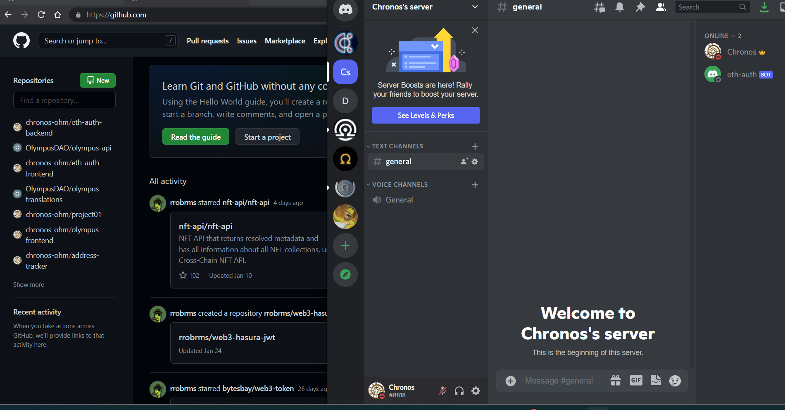

# Verified Ohmies (front-end)

This example serves to illustrate the authentication-flow for the project [Verified Ohmies](https://www.notion.so/olympusdao/Active-Projects-703c573f1fdc42af95035fce2dca2321?p=62e7d754a50140e3a7f5775efff3089d).

Contents
========
 * [How It Works](#how-it-works)
 * [Requirements](#requirements)
 * [Setup](#setup)
 * [Deployment](#deployment)
 * [Future improvements](#future-improvements)

### How It Works



1. The user calls the authentication command in the Discord server, from which they receive the authentication URL containing a JWT in an argument called `id`. This JWT contains their Discord user ID, so that each user can only authenticate themselves and not other users. The logic that is executed when this command is called can be found in `olympus-api/lambda/verified-ohmies/commands/authenticate.ts`.
2. Once the user clicks the URL they are directed to the authentication landing page, where they can connect their Metamask wallet.
3. After the user has connected their wallet they are free to change the chain to the ones that are supported (currently only Ethereum Mainnet is supported), to authenticate on other chains. On the front-end there's also displayed the user's balance for the Olympus tokens that are accepted for authentication on the selected chain. These balance values are received through a call to the endpoint implemented in `olympus-api/lambda/verified-ohmies/api/v1/balances.ts`, which calls the Covalent API to get the balances for the address and chain the user has selected on Metamask.
4. If the selected address owns Olympus tokens, the button "Authenticate" will show up. If not, they'll just get a message stating that they don't own any tokens.
5. When they click "Authenticate", a `GET` request is made to the endpoint implemented in `olympus-api/lambda/verified-ohmies/api/v1/authentication.ts`, sending the arguments: 1) JWT received in the URL from the Discord command; 2) Wallet address; 3) Chain ID. The back-end stores this information in Hasura and responds to the `GET` request with a nonce (a challenge) that the user will have to sign. The nonce is also stored in Hasura so that it can be retrieved in the next step.
6. Once the front-end receives this nonce, a signature request on Metamask gets triggered and when the user clicks "Sign", this sends a `POST` request to `olympus-api/lambda/verified-ohmies/api/v1/authentication.ts` with the arguments: 1) Signature; 2) JWT. Upon receival of this `POST` request the back-end retrieves back from Hasura the address and nonce for this specific Discord user ID (defined inside the JWT), and verifies whether the signature the user sent us is authentic, i.e. whether the signature/nonce pair matches the address the user claimed to have in the previous step.
7. Case the address verification in the previous step was successful, the back-end calls the Covalent API to verify whether that address owns Olympus tokens and, if they do, the Discord API is called to attribute the verified role to this Discord user ID. In case of success, the user also receives a PM stating that their authentication was successful and containing the authentication details: address, chain ID, and name of the token used for authentication.

### Requirements

- Vercel account and Vercel CLI
- Node version 14

### Setup

##### Install dependencies locally

```sh
# To run the project locally
cd root folder of this project
yarn install
vercel dev
```

> You need to launch `olympus-api/lambda/verified-ohmies/` or deploy it

##### Vercel
- Create the same `.env.example` variables on the Vercel project


### Deployment

```sh
vercel --prod
```

### Future Improvements
- Add landing page for returning users which confirms that they're already authenticated. Also add the possibility to remove authentication and remove their data from our servers.
- Improve front-end transitions when switching to a different address/chain on Metamask. Currently a full page refresh is triggered on change, which makes the button "Connect Wallet" show up.
- Instead of having all the wallet state & logic in `pages/index.tsx`, create a context wrapper for that.
